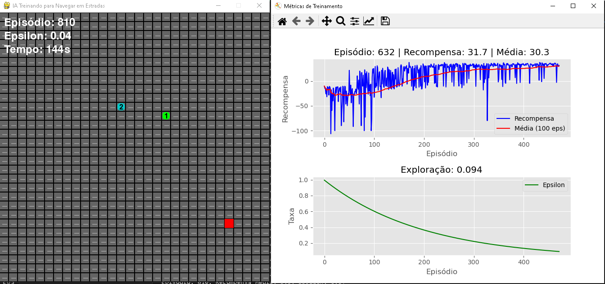

# 🚀 IA de Navegação em Labirintos - Q-Learning

## 🎮 Demonstração Visual

<div align="center">
  
  
  *Captura de tela mostrando o agente (vermelho) navegando pelo labirinto com checkpoints (azul/verde)*
</div>

### 📌 Elementos Destacados:
- 🟥 **Agente IA**: Representado pelo quadrado vermelho 
- 📈 **HUD**: Exibe episódio atual, epsilon e tempo

## 📝 Descrição

Este projeto implementa um agente de IA que aprende a navegar por labirintos gerados proceduralmente usando o algoritmo Q-Learning. O sistema inclui:

- Geração automática de labirintos complexos
- Sistema de checkpoints progressivos
- Visualização em tempo real do aprendizado
- Gráficos de métricas de desempenho
- Sistema de salvamento do progresso

## ✨ Funcionalidades Principais

| Feature | Descrição |
|---------|-----------|
| 🧠 Algoritmo Q-Learning | Implementação eficiente com tabela Q otimizada |
| 🏗️ Labirintos Procedurais | Geração automática com múltiplos caminhos |
| 📊 Visualização em Tempo Real | Gráficos de desempenho e progresso |
| 💾 Sistema de Salvamento | Persistência do modelo treinado |
| 🎮 Controle Interativo | Teclas para salvar/carregar durante a execução |

## 🛠️ Tecnologias Utilizadas

- Python 3.12
- Pygame (renderização gráfica)
- Matplotlib (visualização de dados)
- Numpy (cálculos matriciais)
- Multiprocessing (gráficos em tempo real)

## ⚙️ Instalação

1. Clone o repositório:
```bash
git clone https://github.com/monokatarina/IA_traning.git
cd ia-labirintos
```

2. Instale as dependências:
```bash
pip install -r requirements.txt
```

3. Execute o programa:
```bash
python main.py
```

## 🕹️ Controles

| Tecla | Ação |
|-------|------|
| `S` | Salvar o progresso atual |
| `L` | Carregar progresso salvo |
| `ESC` | Sair do programa |
| `X` | Fechar janela |

## 📊 Métricas de Desempenho

O sistema monitora e exibe em tempo real:
- Recompensa por episódio
- Média móvel de recompensas
- Taxa de exploração (ε)
- Progresso nos checkpoints

## 🤝 Como Contribuir

1. Faça um fork do projeto
2. Crie sua branch (`git checkout -b feature/AmazingFeature`)
3. Commit suas mudanças (`git commit -m 'Add some AmazingFeature'`)
4. Push para a branch (`git push origin feature/AmazingFeature`)
5. Abra um Pull Request

## 📄 Licença

Distribuído sob a licença MIT. Veja `LICENSE` para mais informações.


<div align="center">
  <sub>Desenvolvido com ❤️ e Python</sub>
</div>
